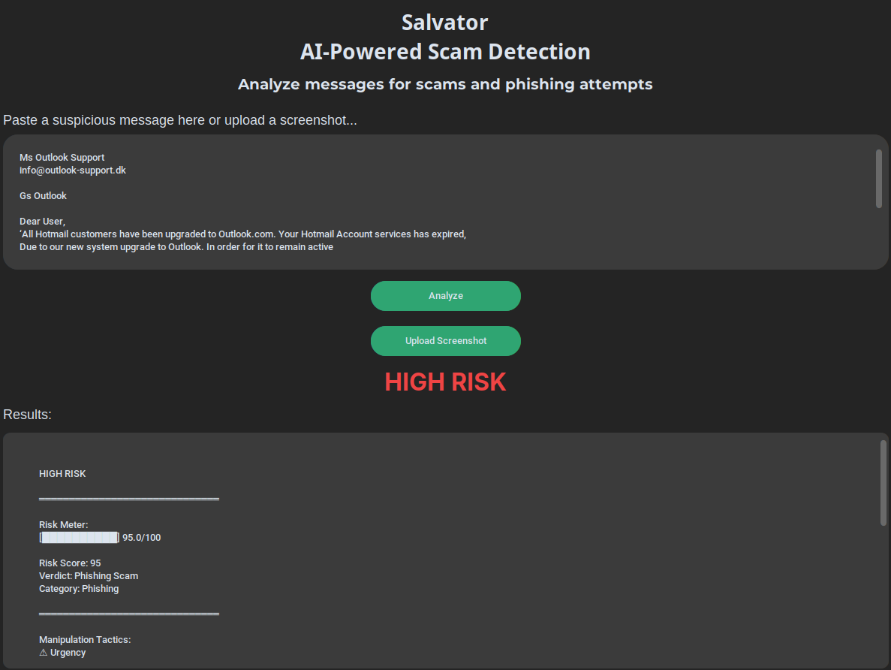
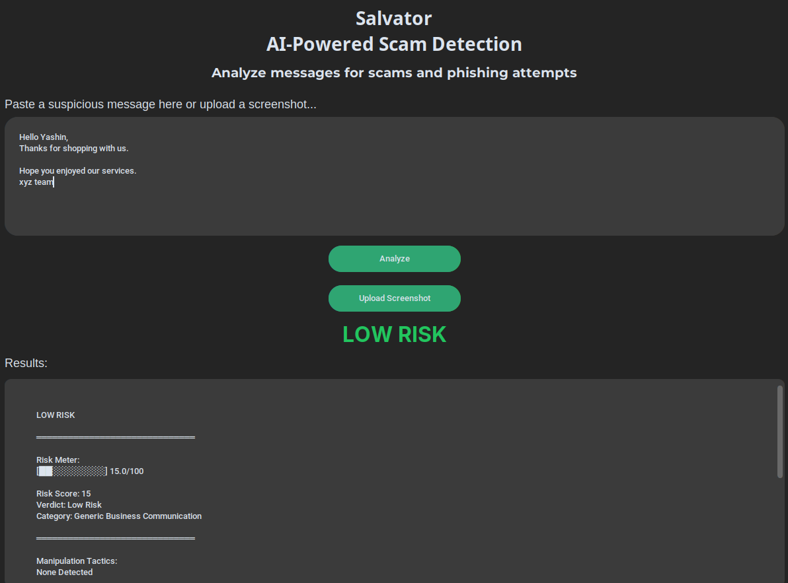

# SALVATOR
An AI-powered cybersecurity tool that detects scams, phishing attempts, and social engineering messages using Google's Gemini AI and OCR technology.

SALVTATOR analyzes suspicious messages, identifies manipulation tactics, highlights red flags, assigns a risk score, and provides actionable security recommendations. Users can either paste text directly or upload screenshots from SMS, WhatsApp, email, or social media conversations.

---

## Features

* AI-powered scam and phishing detection
* Risk scoring system (0–100)
* Visual risk meter
* Scam category identification
* Manipulation tactic detection
* Red flag analysis
* Recommended security actions
* OCR-based screenshot scanning
* Automatic text extraction from uploaded images
* Modern dark-themed CustomTkinter interface

---

## How It Works

### Text Analysis

1. User pastes a message.
2. Gemini AI analyzes the content.
3. SALVATOR generates:

   * Risk Score
   * Verdict
   * Category
   * Manipulation Tactics
   * Red Flags
   * Explanation
   * Recommended Action

### Screenshot Analysis

1. User uploads a screenshot.
2. OCR extracts the text using Tesseract.
3. Extracted text is analyzed by Gemini AI.
4. Results are displayed automatically.

---

## Screenshots

### High-Risk Phishing Detection



### Legitimate Message Analysis



---

## Technologies Used

* Python
* Google Gemini API
* CustomTkinter
* Tesseract OCR
* Pillow (PIL)
* Pytesseract

---

## Installation

### Clone Repository

```bash
git clone https://github.com/pelagornisandersi/SALVATOR.git
cd SALVATOR
```

### Install Python Dependencies

```bash
pip install -r requirements.txt
```

### Install Tesseract OCR

#### Fedora

```bash
sudo dnf install tesseract
```

#### Ubuntu

```bash
sudo apt install tesseract-ocr
```

### Configure Gemini API Key

#### Create a gemini api key
```bash
export GEMINI_API_KEY="YOUR_API_KEY_GOES_HERE"
```

---

## Project Structure

```text
SALVATOR/
│
├── main.py
├── analyzer.py
├── ocr.py
├── requirements.txt
├── README.md
└── screenshots/
```

---

## Future Improvements

* Scan history database
* PDF report generation
* Browser extension
* Email scanning support
* Real-time URL reputation checking
* Mobile application version

---

## Disclaimer

SALVATOR is designed as an educational cybersecurity project and should not be considered a replacement for professional security tools or services.
